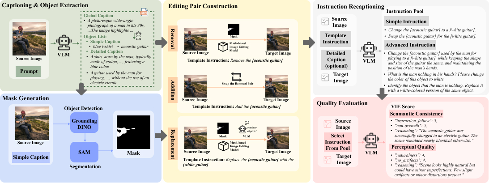
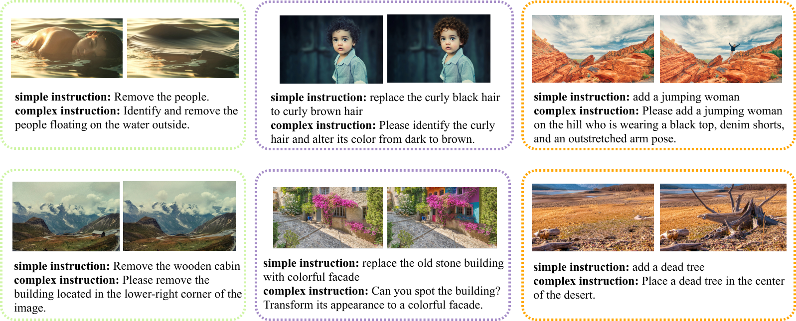
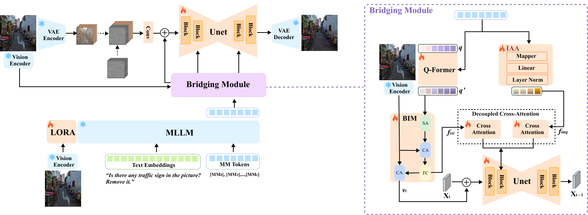

# InsightEdit: Towards Better Instruction Following for Image Editing
## Overview
This repository contains the official implementaion of our InsightEdit. In this work, we first curated the AdvancedEdit dataset using a novel data construction pipeline, formulating a large-scale dataset with high visual quality, complex instructions, and good background consistency. 
Then, to further inject the rich image information, we introduce a two-stream bridging mechanism utilizing both the textual and visual features reasoned by the powerful Multimodal Large Language Models (MLLM) to guide the image editing process more precisely. 

### Dataset Construction Pipeline


### Dataset Examples


### Method


## News
- [05/12/2024] ⏰ I'm trying to re-organize the corresponding code, materials and dataset as soon as I can.
- [26/11/2024] 🎉 The paper appears on Arxiv.

## Citation
If you find this work useful in your research, please consider citing:
```bibtex
@article{xu2024insightedit,
  title={InsightEdit: Towards Better Instruction Following for Image Editing},
  author={Xu, Yingjing and Kong, Jie and Wang, Jiazhi and Pan, Xiao and Lin, Bo and Liu, Qiang},
  journal={arXiv preprint arXiv:2411.17323},
  year={2024}
}
```
